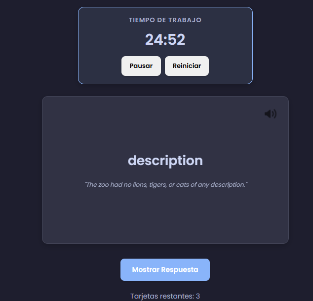
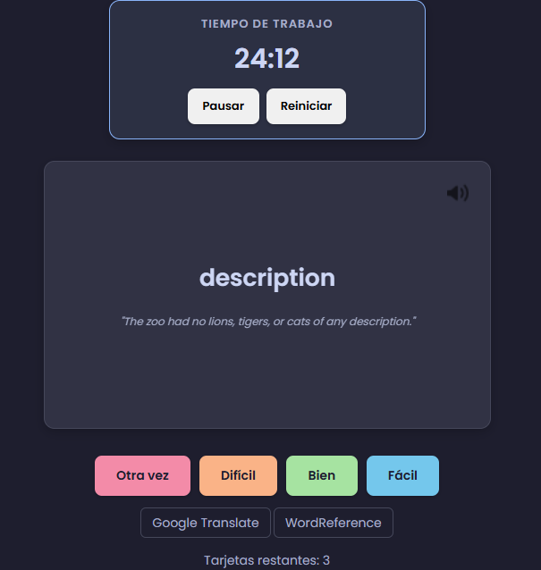

# LinguaClip - Browser Extension

 

**LinguaClip** is a browser extension designed to help you learn new languages while browsing the web. Easily capture, save, and learn new words and phrases you encounter online. Make your language learning more effective and integrated into your daily routine!

## 🚀 Features

*   **Capture and Save:** Select any word or phrase on a webpage and save it to your personal vocabulary list with one click.
*   **Instant Translations:** Get instant translations and definitions for captured words.
*   **Organize Vocabulary:** Manage your saved words in customizable lists for better study.
*   **Progress Tracking:** Visualize your learning progress with interactive charts. Track how many words you've learned over time thanks to integration with [Chart.js](https://www.chartjs.org/).

## 🛠️ Technologies Used

*   HTML5
*   CSS3
*   JavaScript
*   [Chart.js](https://www.chartjs.org/) v4.5.0 for data visualization.

## 📦 Installation

Currently, the extension can be manually installed on Chromium-based browsers (Chrome, Edge, Brave, etc.).

1.  Download or clone this repository:
    ```bash
    git clone https://github.com/tu-usuario/LinguaClip-extention.git
    ```
2.  Open your browser and go to the extensions page (`chrome://extensions` or `edge://extensions`).
3.  Enable **Developer mode** (usually a toggle in the top-right corner).
4.  Click the **"Load unpacked"** button.
5.  Select the `LinguaClip` folder inside the cloned repository.
6.  Done! The LinguaClip extension should appear in your extensions bar.

## 📖 How to Use

1.  Browse any webpage in the language you're learning.
2.  Select an unknown word or phrase.
3.  Right-click and choose "Save with LinguaClip" (or use the extension popup).
4.  Open the extension by clicking its icon in the toolbar to view your vocabulary lists, translations, and progress.

## 🖼️ Preview



## 🤝 Contributions

Contributions are welcome. If you'd like to improve LinguaClip, please follow these steps:

1.  Fork this repository.
2.  Create a new branch (`git checkout -b feature/new-feature`).
3.  Make your changes and commit them (`git commit -m 'Add new feature'`).
4.  Push to the branch (`git push origin feature/new-feature`).
5.  Open a Pull Request.

## 📄 License

This project is licensed under the MIT License. See the `LICENSE` file for details.